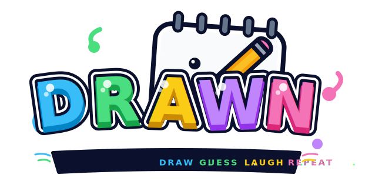
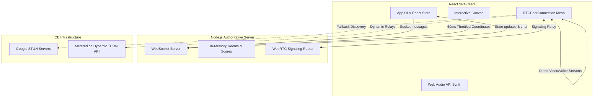

# Drawn — Live Collaborative Multi-Tool Drawing & Guessing Showdown

Drawn is a real-time, peer-to-peer cooperative social canvas game that integrates synchronized multiplayer gaming, interactive 2D canvas drawing tools, custom Web Audio synthesis, and low-latency WebRTC video and voice feeds directly into a zero-install browser landing page.

---

## Project Overview

**Drawn** is a modern recreation of digital game nights. Players join a shared room lobby, take turns sketching randomly drawn prompts from a dictionary pool, and earn points by deciphering guesses from their peers under an active timer. To bring the physical proximity of parlor games online, Drawn overlays real-time WebRTC audio-video blocks directly alongside the interactive board, complemented by browser-synthesized retro chiptune audio notifications that react to correctness states and round transitions.

---

## Problem Statement

Traditional online party games require players to navigate fragmented setups:
1. **Tool Proliferation**: Gamers must run separate media platforms (like Discord or Zoom) alongside their web browser to talk and see each other.
2. **High Latency & Synchronization Drifts**: Mismatches between state-synchronization protocols and media pipelines frequently occur. A player might guess the word and celebrate on voice chat before others even receive the WebSocket drawing package, spoiling the round.
3. **Hardware Overhead & Connection Blockage**: Running heavy background voice channels on lower-end devices or mobile web browsers causes browser tab crashes. Strict NAT routers block standard WebRTC signals on academic or corporate Wi-Fi networks.

Drawn solves these challenges by combining **low-bandwidth drawing rate-limiters**, a **highly-optimized Canvas flood-fill rendering pipeline**, **dynamic TURN server negotiation**, **synthesized chiptunes via the Web Audio API**, and **unified signaling WebSockets** into a single lightweight React application.

---

## Core Features

- **Responsive Multi-Tool Canvas**: Support for free-hand brushing, lines, rectangles, circles, arrows, triangles, stars, diamonds, and a custom flood-fill algorithm.
- **Embedded WebRTC Media Space**: Inline cameras and mic feeds with simple mute controls, integrated directly inside each player's status card.
- **Authoritative Server Game Loop**: Manages selection phases, lobby configuration, host migrations, player kicks, and automatic scoring based on speed of correct guesses.
- **Web Audio API retro Chiptunes**: Synthesizes 8-bit rising arpeggios, victories fanfares, major 7th round chord rolls, and urgent timer ticks entirely in client-side code without downloading MP3 audio assets.
- **Interactive Celebration Overlay**: Features confetti and emoji particle physics spraying from winners or screen edges, running on a separate overlay canvas using `requestAnimationFrame`.
- **15-Second Session Recovery**: Keeps player scoreboards, roles, and host privileges active when browser tabs are accidentally refreshed, gracefully renegotiating active media streams upon rejoining.

---

## Architecture Overview

Drawn utilizes an authoritative server and a mesh-network client-server architecture:



- **Vite & Tailwind CSS v4 Client**: Powers a responsive UI built around a strict 4:3 canvas aspect-ratio grid.
- **Express & WebSocket Server**: Acts as the single point of truth. All game clocks, score logic, and drawing stroke histories are maintained in server memory.
- **P2P WebRTC Mesh Network**: Clients communicate directly with peers for audio/video packets. The WebSocket server acts as the WebRTC Signaling Broker, exchanging SDP offers, answers, and ICE candidates.

---

## Engineering Highlights

### 1. WebRTC Connection Renegotiation & Mesh Signaling
Rather than using heavy central media servers, Drawn uses a full-mesh topology. When a new player enters, the signaling pathway automatically launches calls:
- Coordinates peer registration using [AudioVideoRoom.tsx](file:///Users/swas_k/antigravity/Scribble-Voice-&-Video-Showdown-2026-07-02-1904e/src/components/AudioVideoRoom.tsx).
- Listens for `'webrtc_signal'` transfers and manages SDP configurations.
- Implements connection renegotiation hooks. If a player toggles their camera or microphone, the system updates their media profiles and renegotiates details across existing peer connections without resetting the socket session.

### 2. Graceful Session Recovery & Media Cleanups
To combat unstable networking or accidental browser page reloads:
- Player authentication state and room coordinates are cached in browser `sessionStorage`.
- The backend holds room slots for up to 15 seconds during a disconnect event.
- When rejoining, the system closes stale peer channels, destroys dead connections on other clients via `peer_disconnected` messages, generates a fresh `join_success` payload containing the stroke logs, and completes a clean WebRTC handshake.

### 3. High-Performance Queue-Based Flood Fill
Standard recursion-based flood fill algorithms easily trigger call stack overflows on large mobile canvasses. Drawn implements an optimized loop in [DrawingCanvas.tsx](file:///Users/swas_k/antigravity/Scribble-Voice-&-Video-Showdown-2026-07-02-1904e/src/components/DrawingCanvas.tsx#L37-L144):
- Replaces recursion with flat `Int32Array` coordinate queues and `Uint8Array` visited flags.
- Directly accesses canvas `ImageData.data` buffers for high frame-rate performance.
- Computes color distances using threshold logic to avoid edge bleed and anti-aliasing artifacts:
  $$\text{Distance} = |R_{1} - R_{2}| + |G_{1} - G_{2}| + |B_{1} - B_{2}| + |A_{1} - A_{2}| < 96$$

---

## Performance Highlights

- **Drawing Coordinator Throttling**: Interactive strokes are translated into coordinate vectors normalized between `[0,1]`. This makes drawing independent of viewport resolution and coordinates are throttled to a 60ms broadcast queue, reducing network load.
- **Dynamic ICE Negotiation**: The client queries the Metered API on room generation to load active TURN relay addresses, resolving firewall blockages.
- **Low Garbage Collection Overheads**: Particle bursts are recycled inside a flat particle array and cleaned in single-frame sweeps. Sound synthesis uses dynamic oscillator nodes that automatically clean up when they expire.

---

## Repository Structure

```
drawn/
├── README.md                           # Main landing page documentation
├── LICENSE                             # Project license details
├── CONTRIBUTING.md                     # Open-source contributions guide
│
├── package.json                        # Dependency manifest
├── tsconfig.json                       # TS compiler configurations
├── vite.config.ts                      # Client asset bundling rules
├── server.ts                           # Express server, WebSockets state machine, and WebRTC signalling
│
├── src/
│   ├── main.tsx                        # Frontend entry point
│   ├── App.tsx                         # Client application controller & socket processor
│   ├── index.css                       # Design system theme & Tailwind 4 setup
│   ├── types.ts                        # Unified TypeScript definitions
│   │
│   └── components/
│       ├── DrawingCanvas.tsx           # Multi-tool HTML5 drawing canvas
│       ├── AudioVideoRoom.tsx          # WebRTC signaling handler
│       ├── CelebrationOverlay.tsx      # Canvas particles & Web Audio synth engine
│       └── DrawnLogo.tsx               # Beautiful SVG branding element
│
├── docs/                               # Deeper engineering documentation
│   ├── overview.md
│   ├── architecture.md
│   ├── product-decisions.md
│   ├── networking.md
│   ├── rendering-engine.md
│   ├── synchronization.md
│   ├── audio-engine.md
│   ├── performance.md
│   ├── scalability.md
│   ├── reliability.md
│   ├── security.md
│   ├── benchmarking.md
│   ├── roadmap.md
│   ├── lessons-learned.md
│   └── glossary.md
│
├── docs/adr/                           # Architectural Decision Records
├── docs/diagrams/                      # Architecture & sequence diagrams
├── docs/case-study/                    # Production case studies
├── docs/postmortems/                   # Postmortems & event reviews
└── docs/blogs/                         # Engineering blog posts
```

---

## Documentation Index

Explore our design documents for detailed breakdowns of our codebase and systems:

* **High-Level Design & Decisions**
  * [Product Decisions & Goals](file:///Users/swas_k/antigravity/Scribble-Voice-&-Video-Showdown-2026-07-02-1904e/docs/product-decisions.md): Insights into UX paradigms and layout choices.
  * [System Overview](file:///Users/swas_k/antigravity/Scribble-Voice-&-Video-Showdown-2026-07-02-1904e/docs/overview.md): High-level description of client and server duties.
  * [Software Architecture](file:///Users/swas_k/antigravity/Scribble-Voice-&-Video-Showdown-2026-07-02-1904e/docs/architecture.md): Code organization, directory structures, and framework layouts.
* **Component-Level Deep Dives**
  * [Networking & WebRTC](file:///Users/swas_k/antigravity/Scribble-Voice-&-Video-Showdown-2026-07-02-1904e/docs/networking.md): Signaling protocols, ICE negotiation, and mesh network setups.
  * [Rendering Engine](file:///Users/swas_k/antigravity/Scribble-Voice-&-Video-Showdown-2026-07-02-1904e/docs/rendering-engine.md): Flood-fill details and shape rendering.
  * [Synchronization Protocol](file:///Users/swas_k/antigravity/Scribble-Voice-&-Video-Showdown-2026-07-02-1904e/docs/synchronization.md): WebSocket payload specs, game ticks, and recovery loops.
  * [Web Audio Engine](file:///Users/swas_k/antigravity/Scribble-Voice-&-Video-Showdown-2026-07-02-1904e/docs/audio-engine.md): Dynamic retro sound generation.
* **Operational Guides**
  * [Performance Engineering](file:///Users/swas_k/antigravity/Scribble-Voice-&-Video-Showdown-2026-07-02-1904e/docs/performance.md): Framerate locks and drawing rate limits.
  * [Scalability Strategy](file:///Users/swas_k/antigravity/Scribble-Voice-&-Video-Showdown-2026-07-02-1904e/docs/scalability.md): Managing high numbers of rooms and mesh connections.
  * [Reliability & Reconnections](file:///Users/swas_k/antigravity/Scribble-Voice-&-Video-Showdown-2026-07-02-1904e/docs/reliability.md): Session recovery and fallback policies.
  * [Security Model](file:///Users/swas_k/antigravity/Scribble-Voice-&-Video-Showdown-2026-07-02-1904e/docs/security.md): Payload validation and media safety controls.
* **Review & Roadmap**
  * [Benchmarking Results](file:///Users/swas_k/antigravity/Scribble-Voice-&-Video-Showdown-2026-07-02-1904e/docs/benchmarking.md): Latency rates and client-side processing metrics.
  * [Lessons Learned](file:///Users/swas_k/antigravity/Scribble-Voice-&-Video-Showdown-2026-07-02-1904e/docs/lessons-learned.md): Key challenges faced during WebRTC renegotiation.
  * [Future Roadmap](file:///Users/swas_k/antigravity/Scribble-Voice-&-Video-Showdown-2026-07-02-1904e/docs/roadmap.md): Planned improvements and AI additions.
  * [Terminology Glossary](file:///Users/swas_k/antigravity/Scribble-Voice-&-Video-Showdown-2026-07-02-1904e/docs/glossary.md): Defining common networking terms.

---

## Tech Stack

| Domain | Technology | Use Case |
| :--- | :--- | :--- |
| **Frontend Framework** | React 19 SPA | Modular layout construction and active client-side state hooks |
| **Styling** | Tailwind CSS v4 + Motion | Modern typography, brand variables, fluid transitions, and responsive grid layouts |
| **Bundling / Build** | Vite 6 | High-speed hot module replacement and client asset compilation |
| **Server Runtime** | Node.js | Fast execution environment for backend typescript states |
| **Backend State & Routing** | Express | HTTP asset deliveries and general health probe routing |
| **WebSockets Connection** | `ws` package | High frequency client coordinates and chat guesses transfer |
| **P2P Signaling** | WebRTC API | Direct voice and video pipelines, bypassing intermediate media nodes |
| **Audio Synthesizer** | Web Audio API | Client-side retro chime oscillators, avoiding static sound file overheads |

---

## Screenshots

- **Main Dashboard Layout**: Center-screen interactive canvas showcasing responsive leaderboard overlays on smaller screens.
- **Media active player cards**: Embedded video stream cards featuring user names, colors, and live audio active levels.
- **Vibrant Celebration bursts**: Particle animations firing during round changes.

---

## Demo

To run a live instance locally or test connections across machines, follow the instructions in the [Installation](#installation) section.

---

## Roadmap

- [ ] **Gemini-Powered Smart Prompts**: Integrate AI models to generate drawing prompt words based on past participant guesses.
- [ ] **Semantic AI Guessing**: Use Gemini vision endpoints to analyze client canvasses in real-time, offering helpful hints or playing as an AI guesser.
- [ ] **Real-Time translation layers**: Translate chat inputs in multi-language lobbies.

---

## Installation

Follow these steps to run a development instance of Drawn on your local machine:

### Prerequisites
- Node.js (v18 or above recommended)
- npm (Node Package Manager)

### Step 1: Install Dependencies
Clone the repository, navigate to the project directory, and install all required modules:
```bash
npm install
```

### Step 2: Configure Environment
Create a `.env` file in the root directory and configure parameters (e.g. port configuration):
```bash
PORT=3000
```

### Step 3: Launch Development Server
Start the development server (runs Vite and the backend node server concurrently using tsx):
```bash
npm run dev
```

Open your browser and navigate to `http://localhost:3000` to start playing. To test multiplayer rooms, open multiple browser windows or share the local address with other machines on your local network.